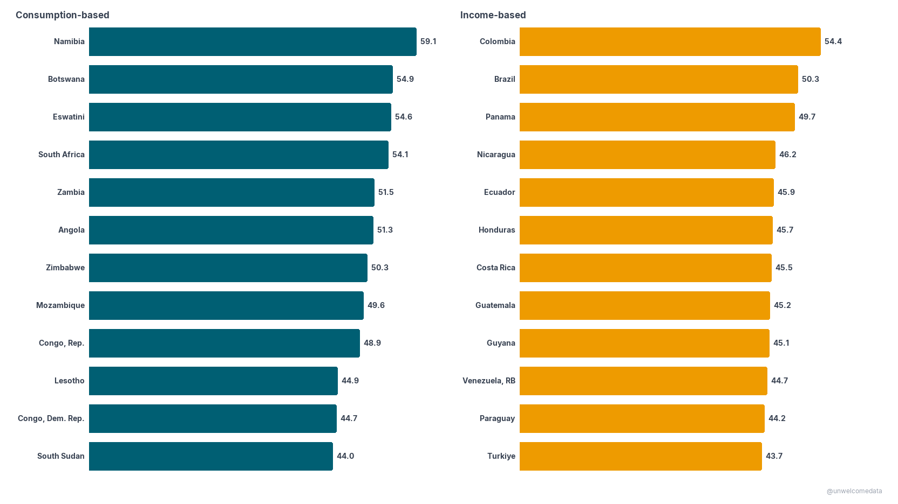
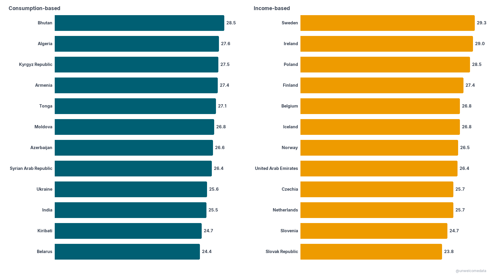
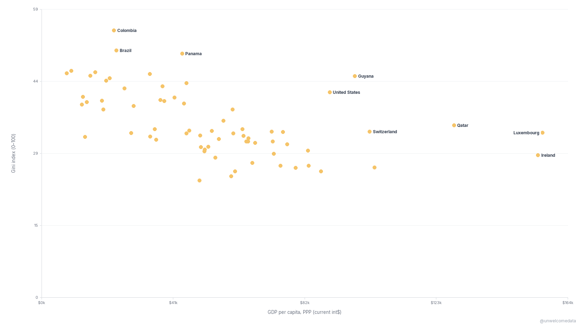
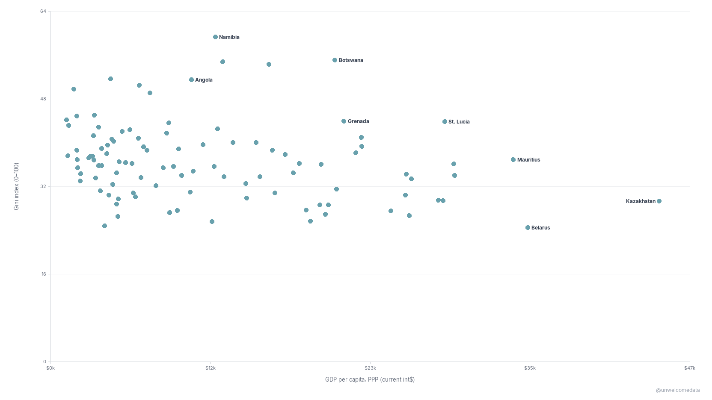
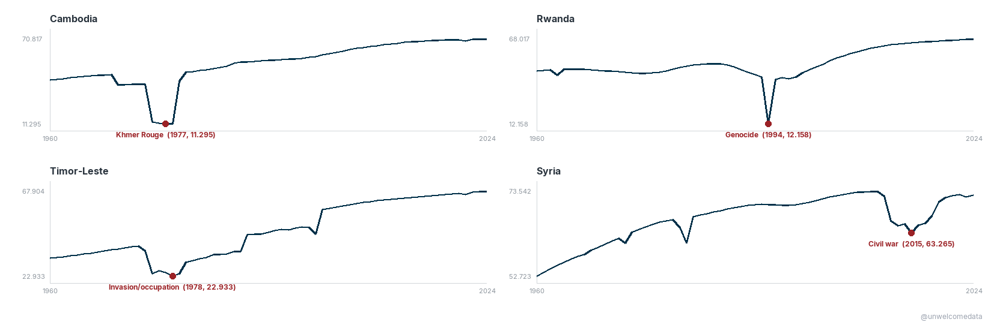
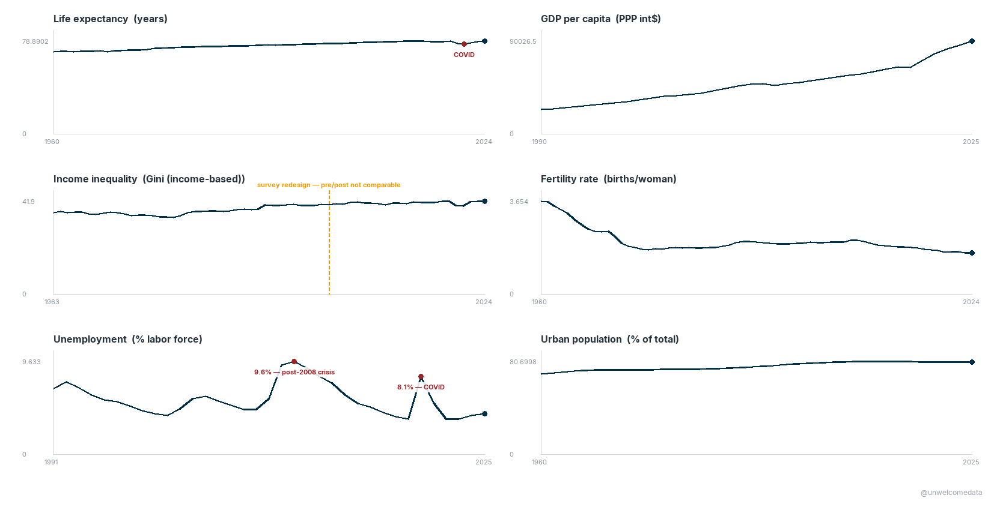
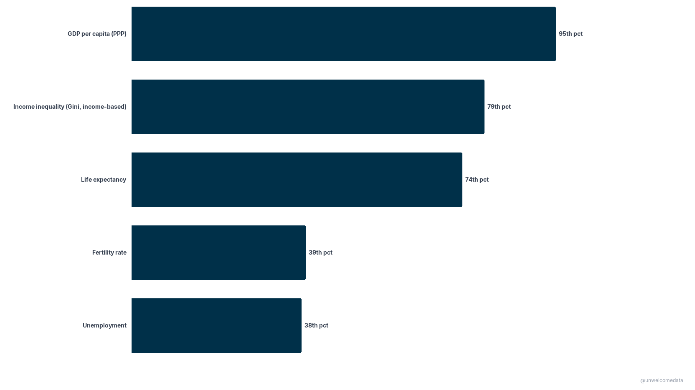

**[@unwelcomedata](https://github.com/unwelcomedata)** · data from public sources

# How Countries Compare

Six everyday measures — income, inequality, life expectancy, fertility, unemployment,
and urbanization — for every country, from the World Bank. The through-line: **you can't
rank the world's inequality on a single list.** The Gini index everyone quotes is measured
two different, non-comparable ways depending on the country, so honest comparison means
keeping them apart — which is exactly what these charts do.

> **The Gini index (0–100)** measures how evenly income or spending is shared: **0 = everyone
> equal, 100 = one person has it all** (higher = more unequal). It's collected two ways —
> *income*-based surveys (typically richer countries) and *consumption*-based surveys (typically
> lower- and middle-income countries) — and **the two are not directly comparable.** Income Ginis
> run several points higher on average purely from method. Every chart here shows the two survey
> types **separately** and never merges them. Source: **World Bank WDI + Poverty & Inequality
> Platform (PIP)**; survey years vary by country.

---

## The most unequal — and the most equal — by survey type

**Highest Gini, each survey type shown separately.** Left: consumption-based surveys (top: Namibia
59.1). Right: income-based (top: Colombia 54.4). The two sides are not comparable — that's the
point of splitting them.

[](docs/c1_most_unequal_by_metric.png)

**Lowest Gini, each survey type shown separately.** Lower = more equal. India's low consumption-based
value partly reflects the metric (consumption spreads narrower than income), not equality alone.

[](docs/c4_most_equal_by_metric.png)

## Wealth vs inequality

**Income-based countries only.** Richer countries here are clearly more equal (correlation r ≈ −0.51).
The **United States is labeled for context**: rich, but unusually unequal for a wealthy country.

[](docs/c6_wealth_vs_inequality_income.png)

**Consumption-based countries only.** The wealth–equality link is weaker here (r ≈ −0.23). The US is
not on this chart — its Gini is income-based, so it appears on the income chart above, never mixed in.

[](docs/c7_wealth_vs_inequality_consumption.png)

## When catastrophe collapses life expectancy

Life expectancy at birth, in years. Each panel is one country **on its own scale**; the marked dot is
the low point and the event that caused it — the Khmer Rouge (Cambodia), the 1994 genocide (Rwanda),
the 1975–78 invasion/occupation (Timor-Leste), and the civil war (Syria, 2015).

[](docs/catastrophe_life_expectancy.png)

## The United States, up close

**The US across the key metrics over time.** Each panel is **0-based** (true scale, not zoomed), so
spikes and dips aren't exaggerated. Inequality shown is the income-based Gini.

[](docs/us_dashboard.png)

**Where the US ranks in the world** — US global percentile on each metric (**100th = highest, 0th =
lowest**). Inequality (Gini) is ranked against income-based countries only. The US is extremely rich
(95th) and unusually unequal (79th), but only middling on life expectancy (74th).

[](docs/us_world_rank.png)

## Every country, one at a time

Pick any country to see all six metrics over time on one page:
**[→ Country profiles (interactive picker)](docs/countries.html)**

---

## The data

The full dataset is in [`export/`](export/):

- **`countries_latest_v1.csv`** — one row per country, latest available value per metric (what the
  ranking and scatter charts are built from), plus each country's Gini survey type and Gini year.
- **`countries_panel_v1.csv`** — the full country × year panel (all metrics, 1960–2025 where available).
- Each ships with a **codebook** (`*_codebook.md`) describing every column in plain English.

## How it was measured

- **Inequality = the Gini index (0–100).** Its single most important caveat is the **income vs
  consumption** split (see the note at the top). This project never ranks an income-Gini country
  against a consumption-Gini country; the US is ranked only against other income-based countries.
- **Gini is not annual.** A country's value reflects its **nearest household-survey year**, not every
  calendar year. Survey years vary widely.
- **Correlations** (r ≈ −0.51 income, r ≈ −0.23 consumption) are Pearson correlations of Gini vs
  GDP per capita (PPP) within each survey pool.
- **One caveat worth stating:** a small number of World Bank series carry demographically implausible
  values (e.g. Central African Republic life expectancy, a modeling artifact); those are suppressed and
  labeled rather than shown. Every value on these charts ties back to the World Bank source.

## Reproduce it

The pipeline is reproducible from the source APIs. The ingest → clean → export logic lives in
[`src/`](src/) (`ingest.py`, `clean_quality.py`, `prepare.py`), driven by `config.yaml`:

```bash
pip install -r requirements.txt
python scripts/reproduce.py        # fetch World Bank WDI + PIP → clean → export
python scripts/validate_charts.py  # re-checks every chart's facts against the data
```

`reproduce.py` is standalone — it runs the `src/` pipeline directly (no notebooks needed) and its
output is byte-for-byte identical to the published exports. See
[`scripts/README.md`](scripts/README.md) for the stage-by-stage details.

## Sources & license

Full attribution, definitions, and methodology/series-break notes are in [SOURCES.md](SOURCES.md).
Data: **World Bank** WDI + PIP (CC-BY 4.0) and ISO 3166 / UN geoscheme region codes. This project's
code and charts are shared for public, non-commercial reference.

## Further exploration

- Regional patterns (the panel carries UN region / sub-region groupings).
- Within-country change over time where a **comparable survey spell** exists (breaks are flagged).
- How the income-vs-consumption gap itself varies by region.

---

> **AI-assisted development.** This project was built with the assistance of
> [Kiro](https://kiro.dev), an AI-powered development environment. All data-sourcing decisions,
> methodology choices, and published findings are the author's. AI was used for code generation,
> pipeline construction, and research assistance — not for analytical conclusions or editorial judgment.
